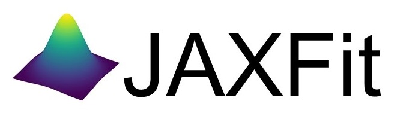

<div align="center">
</img>
</div>

# JAXFit: Nonlinear least squares curve fitting for the GPU/TPU


[**Quickstart**](#quickstart-colab-in-the-cloud)
| [**Install guide**](#installation)
| [**ArXiv Paper**](https://doi.org/10.48550/arXiv.2208.12187)
| [**Documentation**](https://jaxfit.readthedocs.io/)

## What is JAXFit?

JAXFit takes well tested and developed SciPy nonlinear least squares (NLSQ) curve fitting algorithms, but runs them on the GPU/TPU using [JAX](https://jax.readthedocs.io/en/latest/notebooks/quickstart.html) for a massive fit speed up. The package is very easy to use as the fit functions are defined only in Python with no CUDA programming needed. An introductory paper detailing the algorithm and performance improvements over SciPy/Gpufit can be found [here](https://doi.org/10.48550/arXiv.2208.12187).

JAXFit also improves on SciPy's algorithm by taking advantage of JAX's in-built [automatic differentiation](https://jax.readthedocs.io/en/latest/notebooks/autodiff_cookbook.html) (autodiff) of Python functions. We use JAX's autodiff to calculate the Jacobians in the NLSQ algorithms rather than requiring the user to give analytic partial derivatives or using numeric approximation techniques.


We've designed JAXFit to be a drop-in replacement for SciPy's curve_fit function. Below we show how to fit a linear function with some data

```python
import numpy as np
from jaxfit import CurveFit

def linear(x, m, b): # fit function
	return m * x + b

x = [0, 1, 2, 3, 4, 5, 6, 7, 8, 9, 10]
y = [0, 2, 4, 6, 8, 10, 12, 14, 16, 18, 20]

cf = CurveFit()
popt, pcov = cf.curve_fit(linear, x, y)
```

JAXFit takes advantage of JAX's just-in-time compilation (JIT) of Python code to [XLA](https://www.tensorflow.org/xla) which runs on GPU or TPU hardware. 
This means the fit functions you define must be JIT compilable. For basic fit functions this should cause no issues as we simply replace NumPy functions
with their drop-in JAX equivalents. For example we show an exponential fit function

```python
import jax.numpy as jnp

def exp(x, a, b): # fit function
	return jnp.exp(a * x) + b
```


For more complex fit functions there are a few JIT function caveats (see [Current gotchas](#current-gotchas)) such as avoiding control code within the fit function (see [JAX's sharp edges](https://jax.readthedocs.io/en/latest/notebooks/Common_Gotchas_in_JAX.html) 
article for a more in-depth look at JAX specific caveats).


### Contents
* [Quickstart: Colab in the Cloud](#quickstart-colab-in-the-cloud)
* [Current gotchas](#current-gotchas)
* [Installation](#installation)
* [Citing JAXFit](#citing-jax)
* [Reference documentation](#reference-documentation)

## Quickstart: Colab in the Cloud
The easiest way to test out JAXFit is using a Colab notebook connected to a Google Cloud GPU. JAX comes pre-installed so you'll be able to start fitting right away.

We have a few tutorial notebooks including:
- [The basics: fitting basic functions with JAXFit](https://colab.research.google.com/github/Dipolar-Quantum-Gases/jaxfit/blob/main/docs/notebooks/JAXFit_Quickstart.ipynb)
- [Fitting 2D images with JAXFit](https://colab.research.google.com/github/Dipolar-Quantum-Gases/jaxfit/blob/main/docs/notebooks/JAXFit_2D_Gaussian_Demo.ipynb)

## Current gotchas

Full disclosure we've copied most of this from the [JAX repo](https://github.com/google/jax#current-gotchas), but JAXFit inherits
JAX's idiosyncrasies and so the "gotchas" are mostly the same.

### Double precision required
First and foremost by default JAX enforces single precision (32-bit, e.g. `float32`), but JAXFit needs double precision (64-bit, e.g. `float64`). 
[To enable double-precision](https://jax.readthedocs.io/en/latest/notebooks/Common_Gotchas_in_JAX.html#double-64bit-precision)
(64-bit, e.g. `float64`) one needs to set the `jax_enable_x64` variable at startup (or set the environment variable `JAX_ENABLE_X64=True`). 
   
JAXFit does this when it is imported, but should you import JAX before JAXFit, then you'll need to set this flag yourself e.g.

```python
from jax.config import config
config.update("jax_enable_x64", True)

import jax.numpy as jnp
from jaxfit import CurveFit
```

### Other caveats
Below are some more things to be careful of, but a full list can be found in [JAX's Gotchas
Notebook](https://jax.readthedocs.io/en/latest/notebooks/Common_Gotchas_in_JAX.html).
Some standouts:

1. JAX transformations only work on [pure functions](https://en.wikipedia.org/wiki/Pure_function), which don't have side-effects and respect [referential transparency](https://en.wikipedia.org/wiki/Referential_transparency) (i.e. object identity testing with `is` isn't preserved). If you use a JAX transformation on an impure Python function, you might see an error like `Exception: Can't lift Traced...`  or `Exception: Different traces at same level`.
1. [In-place mutating updates of arrays](https://jax.readthedocs.io/en/latest/notebooks/Common_Gotchas_in_JAX.html#in-place-updates), like `x[i] += y`, aren't supported, but [there are functional alternatives](https://jax.readthedocs.io/en/latest/jax.ops.html). Under a `jit`, those functional alternatives will reuse buffers in-place automatically.
1. Some transformations, like `jit`, [constrain how you can use Python control flow](https://jax.readthedocs.io/en/latest/notebooks/Common_Gotchas_in_JAX.html#control-flow). You'll always get loud errors if something goes wrong. You might have to use [jit's static_argnums parameter](https://jax.readthedocs.io/en/latest/jax.html#just-in-time-compilation-jit), [structured control flow primitives](https://jax.readthedocs.io/en/latest/jax.lax.html#control-flow-operators) like [lax.scan](https://jax.readthedocs.io/en/latest/_autosummary/jax.lax.scan.html#jax.lax.scan).
1. Some of NumPy's dtype promotion semantics involving a mix of Python scalars and NumPy types aren't preserved, namely `np.add(1, np.array([2], np.float32)).dtype` is `float64` rather than `float32`.
1. If you're looking for [convolution operators](https://jax.readthedocs.io/en/latest/notebooks/convolutions.html), they're in the `jax.lax` package.


## Installation

JAXFit is written in pure Python and is based on the JAX package. JAX therefore needs to be installed before installing JAXFit via pip. JAX installation requires 
a bit of effort since it is optimized for the computer hardware you'll be using (GPU vs. CPU). 

Installing JAX on Linux is natively supported by the JAX team and instructions
to do so can be found [here](https://github.com/google/jax#installation). 

For Windows systems, the officially supported method is building directly from the source code 
(see [Building JAX from source](https://jax.readthedocs.io/en/latest/developer.html#building-from-source)). However, we've found it easier to use pre-built JAX wheels which can be found in [this Github repo](https://github.com/cloudhan/jax-windows-builder) and we've included detailed instructions on this installation process below.

After installing JAX, you can now install JAXFit via the following pip command

```
pip install jaxfit
```

### Windows JAX install

If you are installing JAX on a Windows machine with a CUDA compatible GPU then you'll need to read the first part. If you're only installing the CPU version

#### Installing CUDA Toolkit
If you'll be running JAX on a CUDA compatible GPU you'll need a CUDA toolkit and CUDnn. We recommend using an Anaconda environment to do all this installation.

First make sure your GPU driver is CUDA compatible and that the latest NVIDIA driver has been installed.

To create a Conda environment with Python 3.9 open up Anaconda Prompt and do the following:

```
conda create -n jaxenv python=3.9
```

Now activate the environment

```
conda activate jaxenv
```

Since all the the pre-built Windows wheels rely on CUDA 11.1 and CUDnn 8.2, we use conda to install these as follows

```
conda install -c conda-forge cudatoolkit=11.1 cudnn=8.2.0
```

However, this toolkit doesn't include the developer tools which JAX also need and therefore these need to be separately installed using

```
conda install -c conda-forge cudatoolkit-dev
```

#### Pip installing pre-built JAX wheel

Pick a jaxlib wheel from the CloudHan repo's list of [pre-built wheels](https://whls.blob.core.windows.net/unstable/index.html). We recommend the latest build (0.3.14) as we've had issues with earlier versions. The Python version of the wheel needs to correspond to the conda environment's Python version (e.g. cp39 corresponds to Python 3.9 for our example) and pip install it. Additionally, you can pick a GPU version (CUDA111) or CPU only version, but we pick a GPU version below.

```
pip install https://whls.blob.core.windows.net/unstable/cuda111/jaxlib-0.3.14+cuda11.cudnn82-cp39-none-win_amd64.whl
```

Next, install the JAX version corresponding to the jaxlib library (a list of jaxlib and JAX releases can be found [here](https://github.com/google/jax/blob/main/CHANGELOG.md)

```
pip install jax==0.3.14
```

<!--For more detail on using these pre-built wheels please see the docs.-->


## Citing JAXFit

If you use JAXFit consider citing the [introductory paper](https://doi.org/10.48550/arXiv.2208.12187):

```
@article{jaxfit,
  title={JAXFit: Trust Region Method for Nonlinear Least-Squares Curve Fitting on the {GPU}},
  author={Hofer, Lucas R and Krstaji{\'c}, Milan and Smith, Robert P},
  journal={arXiv preprint arXiv:2208.12187},
  year={2022}
  url={https://doi.org/10.48550/arXiv.2208.12187}
}
```


## Reference documentation

For details about the JAXFit API, see the
[reference documentation](https://jaxfit.readthedocs.io/).
